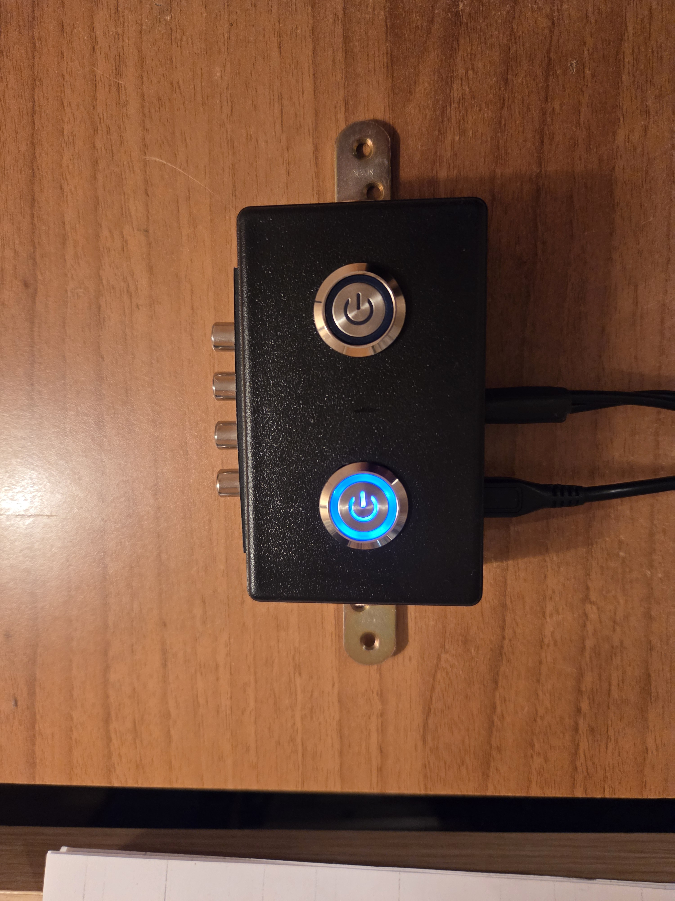

  

Dual Audio In to Single Audio Out Device
-----------------------------------------------------------------

This device implements a dual-input to single output audio switching function. It can be UART interface controlled, or via a two-button keyboard. Its state can be monitored over the UART interface. A USB-to-UART converter IC has been used, so the interface that connects to the host PC is actually USB. The commands must be '\n' terminated.  

Here is a list of the supported commands:  

*IDN? - get device identification string. Returns the string  
"\nDualAUX,hw1.0,sw1.0\n\r".   
*RST - reset device. Returns no string.  
CH0 - selects channel 0. Returns the string "\nCH0 selected!\n".  
CH1 - selects channel 1. Returns the string "\nCH1 selected!\n".  
CH? - get selected channel. Returns either "\nCH0 selected!\n" or  
"\nCH1 selected!\n".  
  
If you enter unsupported command, or if the command synthax is wrong, the string "\nWrong command!\n" is returned. After channel selection, a 3-second timeout is implemented, then the selected channel  number is saved in EEPROM. This makes the device to return the string "\nSaving in EEPROM ...\n". If a keyboard button is pressed, the device returns either the string "\nCH0 selected!\n" or "\nCH1 selected!\n".  

The source code builds with Microchip's MPLAB X IDE v6.30 and their compiler XC8 v3.10.  

